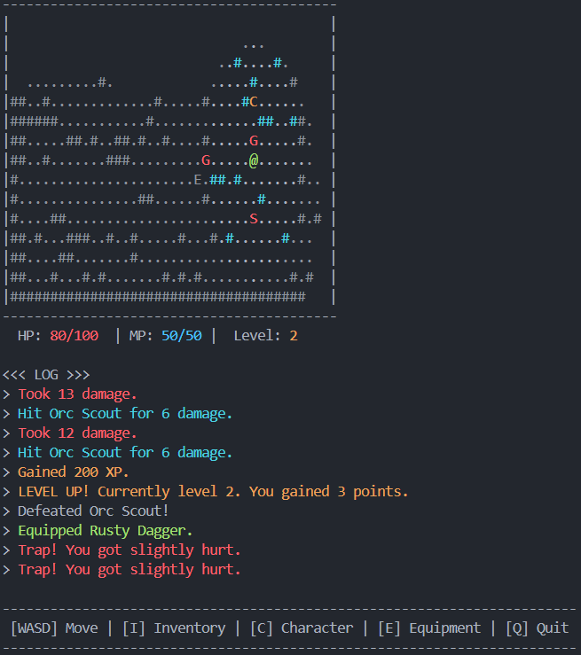

# Text game description:

Rogue Monkey is a text based RPG with turn based combat and procedurally generated levels. Play as a Monkey (@) navigating through a dungeon filled with various enemies and traps. Collect loot, level up and become stronger. It runs in the terminal. Inspired by the game Rogue.

# User interface:

# Running the project:

python main.py